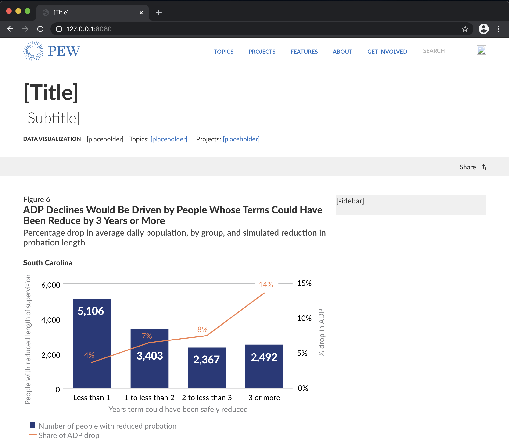
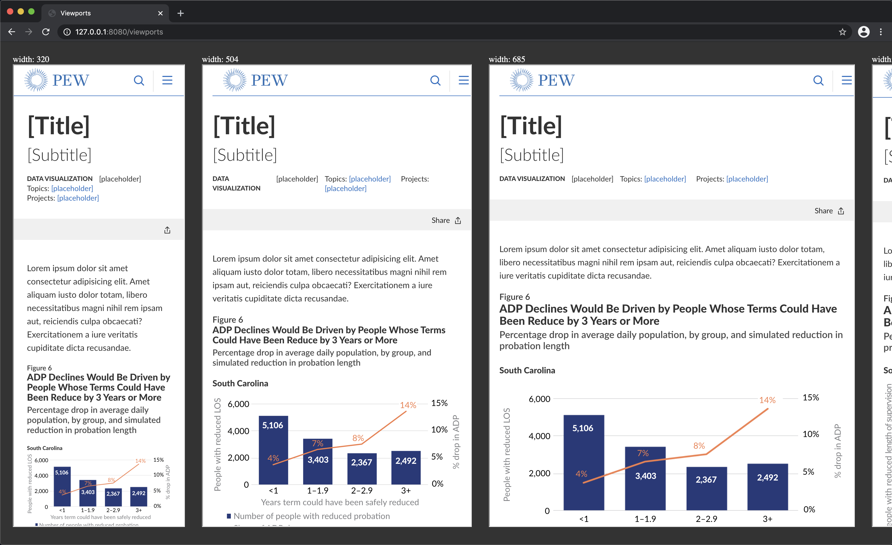
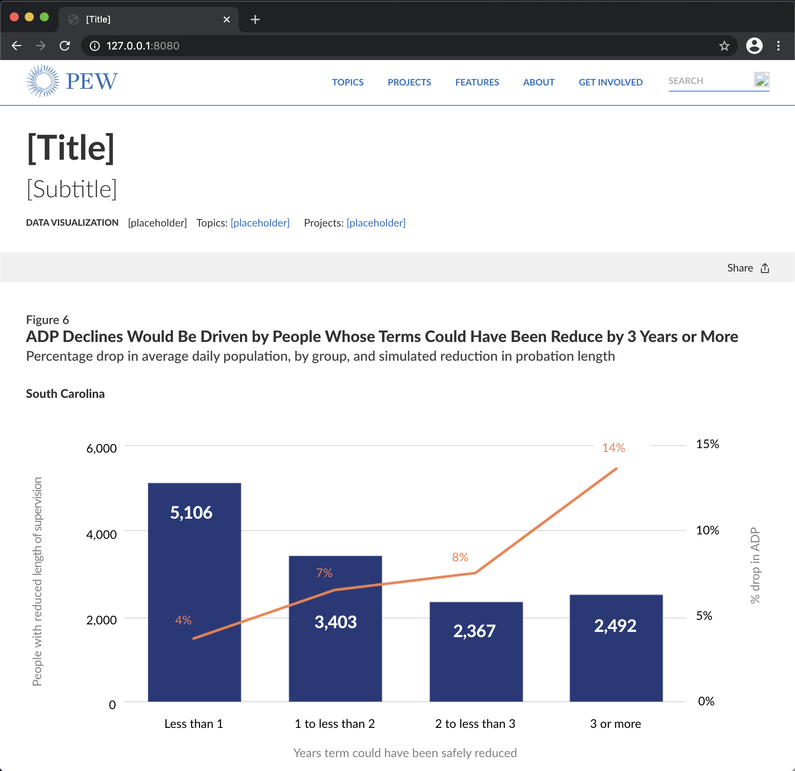
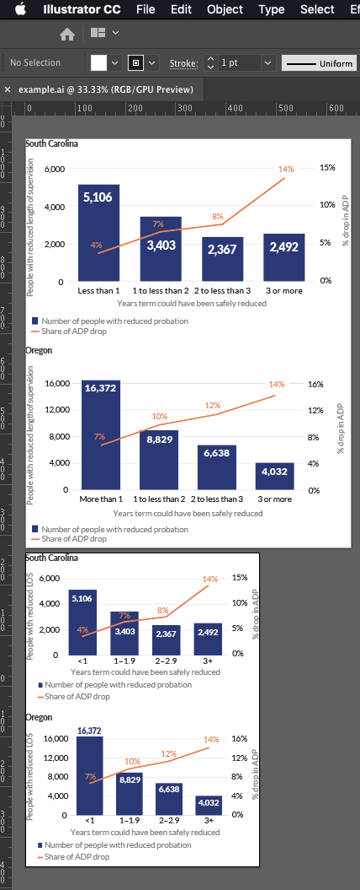
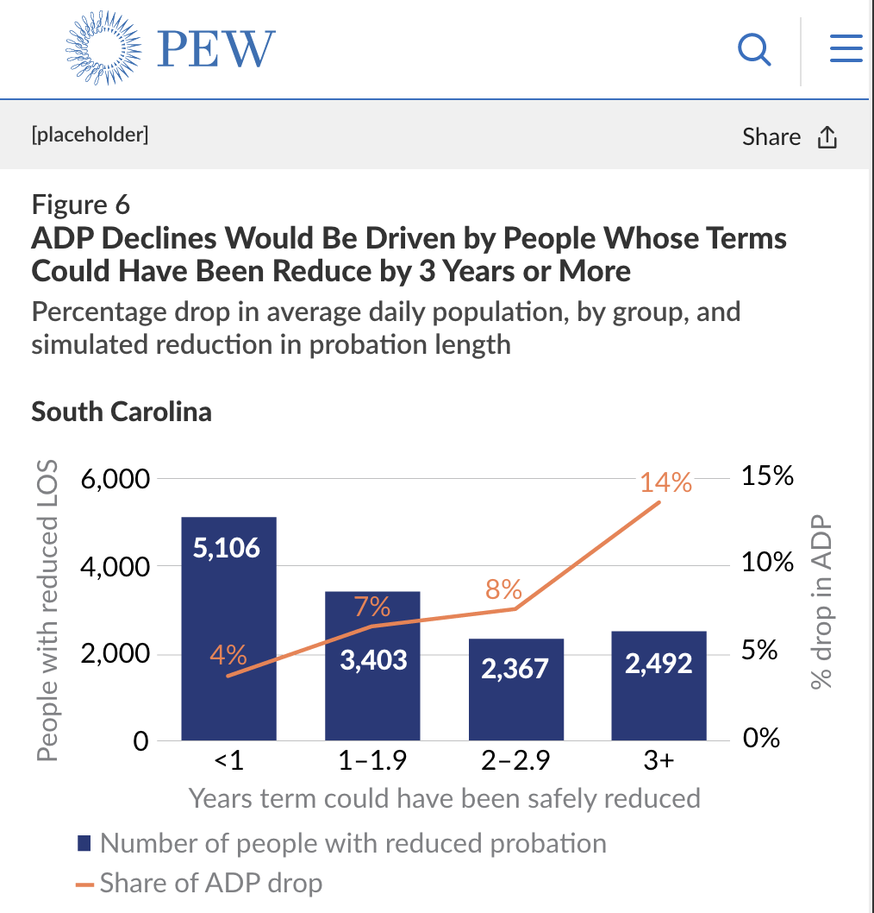
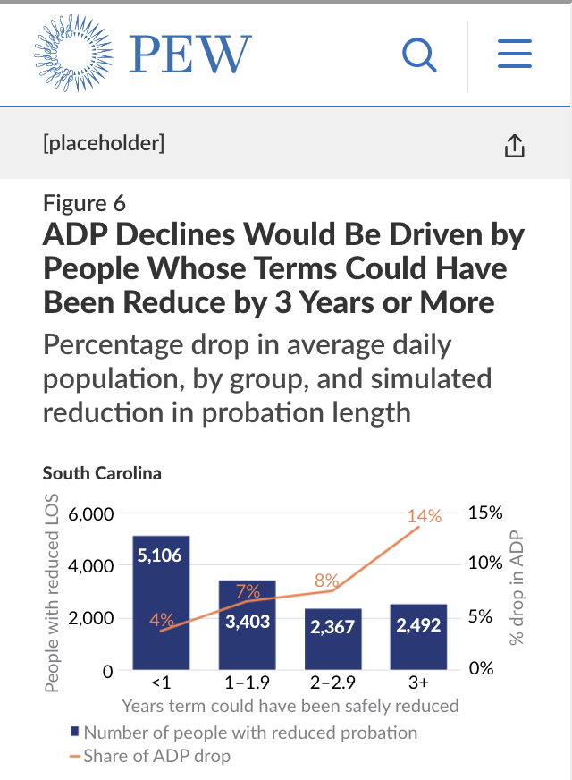
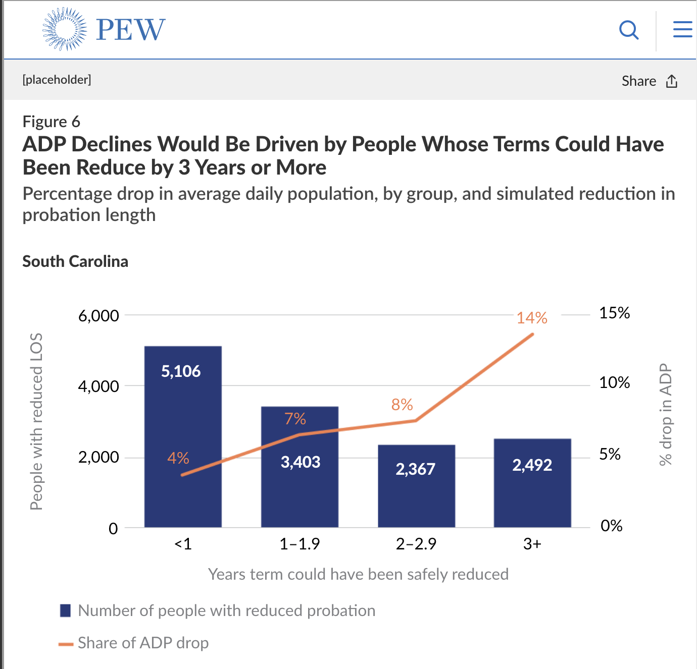
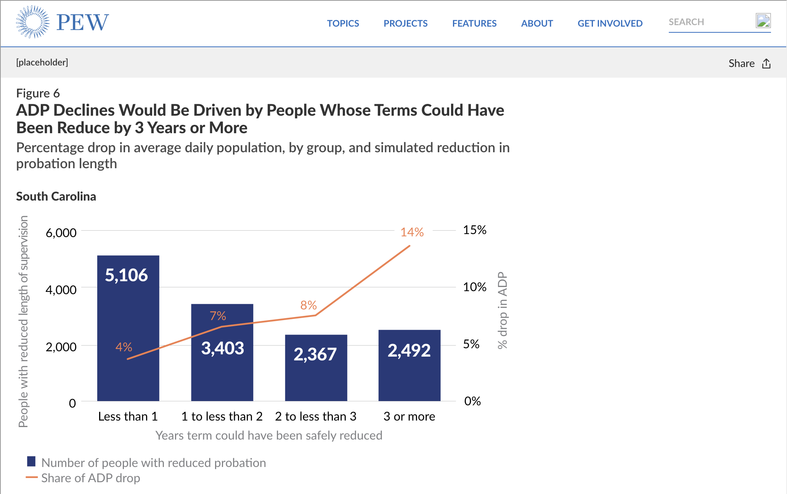
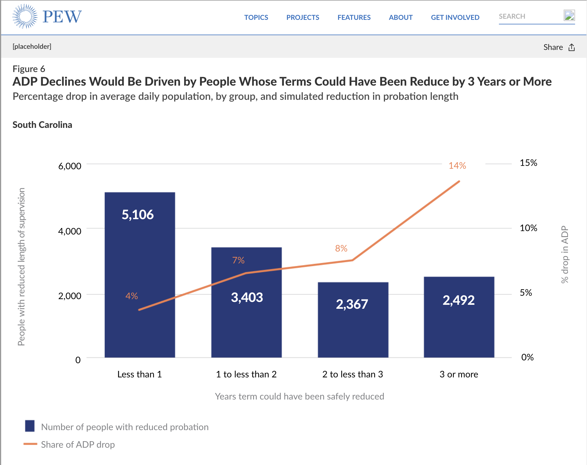

# ai2html builder
The ai2html builder allows designers to immediately see how an Adobe Illustrator asset will look on Pew's website, on multiple screen sizes, after being run through ai2html.

ai2html is a script, originally created by the New York Times,  that separates the text from the art of Illustrator files. The text is converted to HTML positioned over background images. This allows the text to stay the same size as the artwork below is scaled up or down. ai2html can output multiple artboards, of different sizes, in one package so that different versions are displayed at different breakpoints.

## How to set up this tool
The ai2html builder is basically a package of files and Node.js scripts that compile the files into webpages. The tool launches a webserver locally on your machine that displays the webpage. When a file changes, the page automatically reloads to show the changes. To work, you will set up ai2html to place its output files into this package so that when you create or edit ai2html outputs they are automatically displayed on a replica of Pew's website. You can also navigate to another page that shows the content in multiple viewports at the same time.

This tool as several dependencies that designers will need to install on their machines:
1. Node.js
2. npm
3. Git
4. ai2html

### Node and npm
Node is Javascript runtime environment for your machine; npm is a package manager that simplifies installing and managing modules.

The best way to install Node and npm is with nvm (Node version manager). Follow the [installation directions](https://github.com/nvm-sh/nvm#install--update-script) on its Github page. Copy-pasting the `curl` command will be easiest.

After nvm is installed, run the command `nvm install node 14.15.4`. This will install Node and npm.

### Git
Git is version control system for software development. For present purposes, its use is limited to cloning this tool's Github repository onto the designer's machine.

To install Git, select the macOS installer from [Git's download page](https://git-scm.com/downloads).

### ai2html
As mentioned above, ai2html is the script for Adobe Illustrator that separates the text from artwork and allows for outputting multiple artboards for different breakpoints.

Read more about ai2html and how to install it at the [ai2html website](http://ai2html.org/), but **use this link to [download the script](https://raw.githubusercontent.com/jostermanAtPEW/ai2html/master/ai2html.js)** rather than the one provided there. This version has small changes that places text more accurately when it is scaled down; the original script does not anticipate text changing size dynamically.

### Installing this tool
Once all the above software is installed, you're ready to install this tool. You may install it anywhere; the instructions below install in in your home directory.

Open you terminal and navigate to your home directory:

```bash
cd ~
```

Then clone this repository using Git. It will be downloaded into `~/ai2html-builder/`.

```bash
git clone git@github.com:pewtrusts/ai2html-builder.git
```

Then `cd` into that directory and run `npm install` to install of of this tool's dependencies.

```bash
cd ai2html-builder
npm install
```
## How to use this tool 
Using this tool is relatively easy; the harder part is understanding the effects ai2html will have on the assets you create. Perhaps harder still is creating for a fluid-width environment, preferably with a mobile-first approach. More on that below.

To use this tool, `cd` into its directory if you are not already there and run the command to compile the files into a webpage and start a webserver on your machine:

```bash
npm run dev
```

Open an up-to-date browser (Chrome or Firefox) and navigate to 127.0.0.1:8080. You should see the example asset:



### Multiple viewports
To see how an asset will look on multiple screen sizes, navigate your browser to 127.0.0.1:8080/viewports/. On this page, you will be able to immediately see how any changes you make to an asset will show up on different devices.



### Different column widths
The main content of a standard Pew webpage will either be in a 70-percent-width column or 100-percent-width column. Most pages use the 70 percent, and that is the default for this tool. To use the tool with content meant for a 100-percent-width column, use this command below instead of `npm run dev`:

```bash
npm run dev100
```

This will place the asset in a full-width column:



## How to use this tool, pt. 2: the Illustrator side
The standardized way, so far, to use ai2html on Pew's website is to create two versions—two artboards—for each asset. This is a good middle ground that keeps the outputs flexible without overburdening the creation of every asset. The main issue to overcome is the large difference in screen sizes that each asset will need to be displayed on, legibly, from 320px wide to full desktop.

The first artboard is for the asset as it will be displayed at any size less than 650px (when the viewport in less than 686px wide). This artboard must be set to be 468px wide. On the website, after being run through ai2html, the smaller asset will look exactly as designed only when it is that exact width (a viewport of 504px). At smaller sizes, all elements of the asset, including text, will scale down, but the proportions and spacing will be constant. At sizes greater than 468px but less than 650px, the art of the asset will scale up but the text size will not. Text, relative to the size of the asset, will *appear* smaller and the space between text will grow.

The second artboard is for the asset as it will be displayed at 650px, when the viewport is 686px wide or wider. If the final destination you're designing for is a 70-percent-width column, this asset will only be displayed at 650px wide. If the destination is a 100-percent-wide column, the art of the asset will continue to scale up while the text stays the same size.

### In pictures


*Above: The standardized procedure so far uses two artboards for each asset, one set to 468px wide and the other to 650px wide.*



*Above: the 468px-wide asset looks exactly as design after being run through ai2html only when it is 468px wide*



*Above: the 468px-wide asset is scaled down, text included, to fit smaller viewports*



*Above: the art of the 468px-wide asset is scaled up to fit larger viewports less than 686px wide. the text size does not change*



*Above: On viewports 686px wide or wider, the 650px-wide asset is shown. In 70-percent-width columns, the asset will not scale up or down.*



*Above: In 100-percent-width columns, the art of the 650px-wide asset will scale up to fill the column while the text remains the same size*

When designing for 100-percent-width columns, it may be useful to add a third, 990px wide artboard to design exactly how the asset should look at that size.


