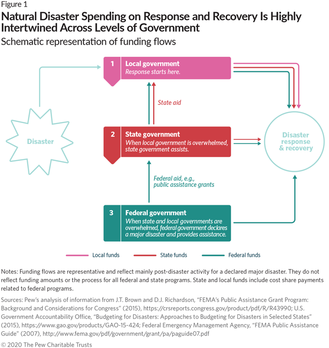
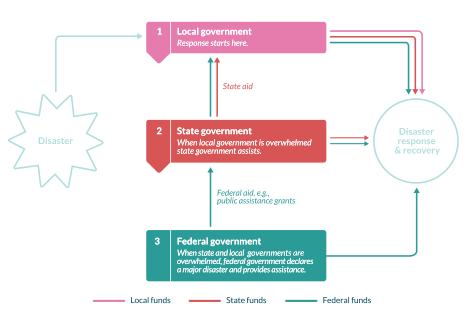

## 1. Raster image

### What's good
* Is exactly as designed

### What's not
* Content is locked up in image. Not accessible to search engines or screen readers
* Lossy resolution
* Becomes illegible at small sizes
* Is extra lossy at certain screen sizes

## 2. SVG instead

### What's good
* Is exactly as designed
* Lossless resolution, crisp
* Content potentially exposed to search engines and screen readers, if used inline

### What's not
* Becomes illegible at small sizes
* Have to handle fonts carefully. Only typefaces available on the website can be used unless text is converted to outlines.

## 3. default ai2html (for illustration—does not work well on purpose)

### What's good
* Text is crisp
* Text is always the same size
* Content is exposed to search engines and screen readers

### What's not
* Does not shrink appropriately, text overlaps

## 4. ai2html using the builder tool

### What's good
* Text is crisp and always legible
* Content exposed to search engines and screen readers
* Integrates hed, dek, notes, and source notes into html output
* Notes can include hyperlinks
* Adapts to screen size
* 650px wide asset uses the 6.5 inch print artboard as-is

## What's not (but not really)
* Two artboards needed, but no longer necessitates separate digital assets.
* More artboards needed for 990px wide content.
* Will need a solution for allowing users to grab an image with text—possible but not built yet.